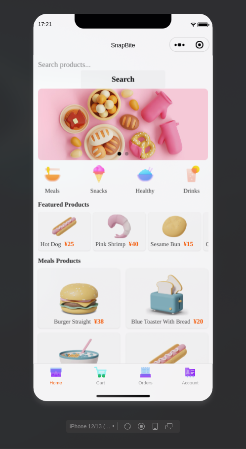
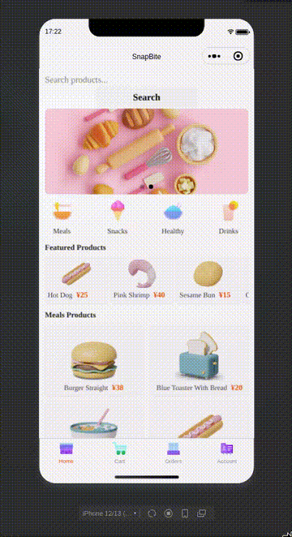
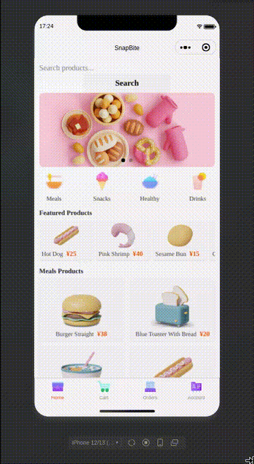

# SnapBite - WeChat Mini Program

A modern food ordering mini program built for the WeChat ecosystem using JavaScript, WXML, and WXSS. The application provides an intuitive mobile interface for browsing products, managing carts, and placing orders.

## Overview

SnapBite is a frontend-focused WeChat Mini Program that simulates an online food shopping experience. The project demonstrates WeChat Mini Program development, UI design, page navigation, and state management.

## Tech Stack

* JavaScript
* WXML
* WXSS
* WeChat Mini Program Framework

## Features

* User login and registration
* Product categories
* Dynamic product listing
* Product detail pages
* Shopping cart management
* Purchase and checkout flow
* Order history
* User profile page

## Project Structure

```text
pages/
├── home/
├── details/
├── cart/
├── payment/
├── orders/
├── orders-list/
├── account/
├── login/
└── register/

assets/
└── icons/

utils/
```

## Preview

### Home Page



### Demo Videos

#### Shopping Flow

Complete purchase workflow, including product browsing, cart management, and checkout.



[Watch Video](./Preview/recording_20260718_17-23-49.mp4)

#### Category Filtering

Demonstrates dynamic filtering between Meals, Snacks, Healthy, and Drinks categories.



[Watch Video](./Preview/recording_20260718_17-25-12.mp4)

## Getting Started

1. Install WeChat Developer Tools.
2. Clone the repository:

```bash
git clone https://github.com/hishamcyber/SnapBite.git
```

3. Open WeChat Developer Tools.
4. Import the project folder.
5. Run the project using the simulator or a physical device.

## Author

Developed by Hicham Ouahbi.
